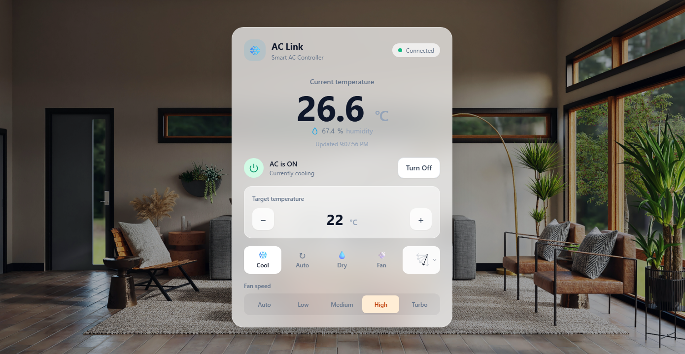

# ❄️ ACLink

<div align="center">

</div>

ACLink is a smart air conditioner controller that allows an existing AC to be controlled remotely through the internet. It uses an ESP32 as the bridge between the AC and the server, sending infrared commands to control the AC just like a traditional remote control.

The project is designed to eventually support **location-based automation**, allowing the AC to be turned on or off automatically based on the user's location.

## ⚙️ How It Works

The system works roughly like this:

```text
📱 Web / Location
        │
        ▼
    🌐 Server
        │
        ▼
    📡 ESP32
        │
        │ 🔴 Infrared
        ▼
    ❄️ Air Conditioner
```

The ESP32 periodically checks the AC state from the server.

If the state changes, the ESP32 sends the corresponding infrared command to the AC.

For example:

```text
🌐 Server: OFF
📡 ESP32:  OFF
      ↓
  No action

🌐 Server: ON
📡 ESP32:  OFF
      ↓
 State changed
      ↓
🔴 Send IR command
      ↓
❄️ AC → ON
```

## ⚠️ Disclaimer

This project is created primarily for **learning and experimentation purposes**.

It is a personal project to explore:

- 📡 ESP32 and embedded systems
- 🔴 Infrared communication
- 🌐 IoT architecture
- 🔗 HTTP / HTTPS communication
- 🏠 Home automation
- 📍 Location-based automation

This project is **not intended to be a production-ready or safety-critical system**.
